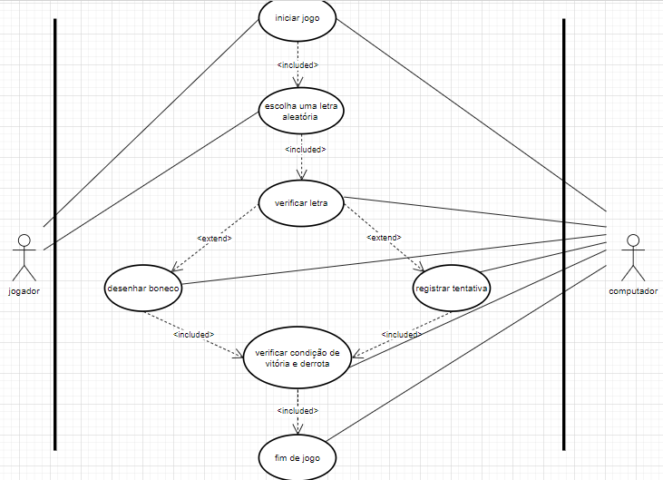

# Jogo_da_Forca
<h2>Diagrama de Classes</h2>

<h3>Classe <code>JogoDaForca</code></h3>

A classe <code>JogoDaForca</code> é responsável por gerenciar o estado global do jogo e controlar o progresso. Ela possui os seguintes atributos e métodos:

<ul>
    <li><code>gerarPalavra</code>: Gera uma palavra aleatoria.</li>
    <li><code>letrasUsadas</code>: Armazena todas as palavras usadas pelo jogador.</li>
    <li><code>tentativasRestantes</code>: Armazena quantas partes do boneca ainda tem para desenhar.</li>
    <li><code>maxTentativas</code>: Mostra o maximo de tentativas que o jogador tem.</li>
    <li><code>numeroPalavra</code>: Mostra quantas letras há na palavra.</li>
</ul>

Métodos:

<ul>
    <li><code>iniciarJogo(gerarPalavra)</code>: Inicia o jogo e automaticamente gera uma palavra aleatoria.</li>
    <li><code>tentarLetra()</code>: O jogador chuta uma letra.</li>
    <li><code>verificarLetra()</code>: Verifica se a letra chutada pelo jogador está correta ou errada.</li>
    <li><code>desenharParteBoneco()</code>: Se a letra for errada, irá ser desenhado uma parte de o boneco.</li>
</ul>
 
<h3>Classe <code>InterfaceForca</code></h3>

A classe <code>bonecoForca</code> é responsável por controlar o progresso do boneco. Ela possui os seguintes atributos e métodos:

<ul>
    <li><code>partesBoneco</code>: O total de partes que o boneco tem, como o braço, a perna ou a cabeça.</li>
    <li><code>partesIncorretas</code>: Armazena todas as partes que o jogador errou.</li>
    <li><code>coordenadasIncorretas</code>: As coordenadas de desenho do boneco.</li>
</ul>

Métodos:

<ul>
    <li><code>adicionarParteIncorreta</code>: Desenha a parte do boneco após dele ter errado.</li>
    <li><code>desenharCabeça()</code>: Desenha a cabeça do boneco.</li>
    <li><code>desenhaTronco()</code>: Desenha tronco do boneco.</li>
    <li><code>desenharBraçoE()</code>: Desenha braço esquerdo do boneco.</li>
    <li><code>desenharBraçoD()</code>: Desenha braço direito do boneco.</li>
    <li><code>desenharPernaE()</code>: Desenha perna esquerda do boneco.</li>
    <li><code>desenharPernaD()</code>: Desenha perna direita do boneco.</li>
</ul>
 
<h3>Classe <code>InterfaceForca</code></h3>

A classe <code>InterfaceForca</code> é responsável por gerenciar o estado do jogo e controlar se o jogo irá reiniciar. Ela possui os seguintes atributos e métodos:

Métodos:

<ul>
    <li><code>atualizarInterface</code>: Atualiza a interface e reinicia o jogo.</li>
</ul>

 
<h2>Diagrama de Atividade</h2>

<h3>Classe <code>JogoDaForca</code></h3>
    <li><code>gerar uma palavra aleatoria</code>: O jogo gera uma palavra aleatoria.</li>
    <li><code>chutar letra</code>: O jogador chuta uma letra.</li>
    <li><code>acrescenta a letra na palavra</code>:Se a letra for correta, é acrescentado a letra na palavra.</li>

<h3>Classe <code>BonecoForca</code></h3>
<ul>
    <li><code>desenhar uma parte do boneco</code>:Se a letra for incorreta, é desenhado uma parte do boneco.</li>
</ul>

 
<h2>Diagrama de Casos de Uso</h2>

<strong>Nome do caso de uso: </strong>Jogo da Forca; 
   <strong>Caso de uso geral: </strong>Adivinhar palavra; 
   <strong>Ator principal: </strong>Jogador; 
   <strong>Ator secundário: </strong>JComputador; 
   <strong>Resumo: </strong>O jogador tem como objetivo acertar a palavra antes de competir o boneco(desenho); 
   <strong>Pré-condições: </strong>Se a palavra for completada antes do boneco ser completado, o jogador ganha e o jogo acaba; 
   <strong>Pré-condições: </strong>Se o boneco for completada antes do boneco ser completado, o jogador perde e o jogo acaba; 
   <strong>Ações do ator: </strong>Ações do sistema do jogo da forca. 

<h2> Ações</h2>
<ol>
  <li>O jogador inicia o jogo;</li>
  <li>O jogo identifica o nível a ser jogado pelo jogador;</li>
  <li>Se o jogador encostar em um obstáculo, perde uma vida;</li>
  <li>Passando pelos obstáculos, o jogador continua jogando até avançar para o próximo nível;</li>
  <li>Se o jogador perder todas as vidas, tem a opção de jogar novamente;</li>
  <li>Concluindo todos os níveis, o jogador tem a opção de jogar novamente.</li>
</ol>
<h3> Restrições</h3>
<ol>
  <li>Para perder o jogo, o jogador deve esgotar suas três vidas.</li>
</ol>

<h2>Ordem</h2>
<h3>Ações do Jogador: </h3>

1,2.

<h3>Ações do Jogo: </h3>

3,4,5,6,7,8,9.

</body>

